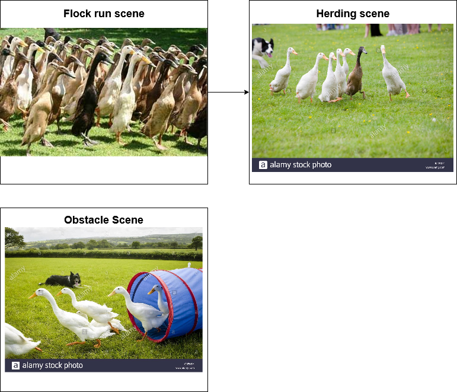

# GE2-AI
 
The assignment will be a herding simulation inspired by Indian Runner Ducks herding.

## How it works:
The project implements a version of Craig Reynold's flocking algorithm. The elements of the flocking algorithm are: cohesion, alignment, and avoidance. The cohesion behaviour finds the midpoint between its neighbour agents and navigates toward it to stay grouped together. Alignment makes sure the agents move in the same direction. Avoidance prevents collision and overlap between the agents. The behaviours are combined using a weighting system.

The Flock object iterates between each flock agent to execute their flocking behaviour. The flock agent is passed into the Calculate method of the Flock object which calculates the movement for each agent independently. A scriptable object is used to store each behaviour data.

For obstacle avoidance a layer mask filter is used. If the mask is equal to the filtered layer it is then added to the list.